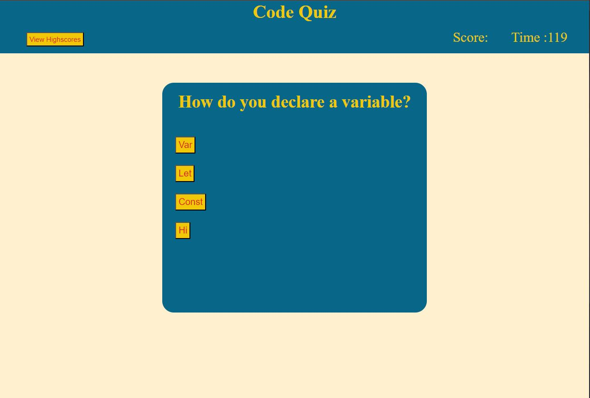

# Challenge 4

## Acceptance Criteria

```
GIVEN I am taking a code quiz
WHEN I click the start button
THEN a timer starts and I am presented with a question
WHEN I answer a question
THEN I am presented with another question
WHEN I answer a question incorrectly
THEN time is subtracted from the clock
WHEN all questions are answered or the timer reaches 0
THEN the game is over
WHEN the game is over
THEN I can save my initials and my score
```

## Photo of Website Functionality
The following Photo shows the web application's appearance and functionality:




# Explanation of what was done

Made a js quiz, that has a running timer, a score system and a highscore memory system!